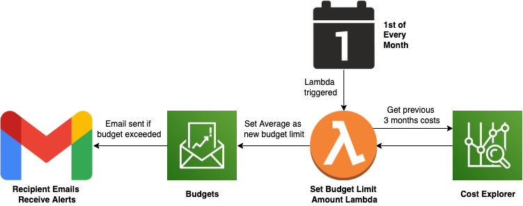

AWS Budgets are a part of AWS Billing. Budgets are configured to send alert emails when we exceed customisable thresholds or when we’re forecast to exceed them. Currently we have two active budgets for all expenditures, one for actual expenditure and the other for forecast expenditure. The threshold is the same for both budgets, and can be set individually withing the module.

Budgets can be focussed down to individual AWS Services, but this is not currently set up in the module.

On the first of each month the `set_budget_limit_amount_lambda` runs. This lambda accesses the AWS Cost Explorer Client via Boto3. It then calculates the average expenditure over the past three months and sets that amount as the new threshold limit for both the actual and forecast Budgets. This ensures that the budget thresholds remains relevant. 

The Lambda automatically sets the actual and forecast budget to the same value, but could be refactored to set them individually, should the need arise. 