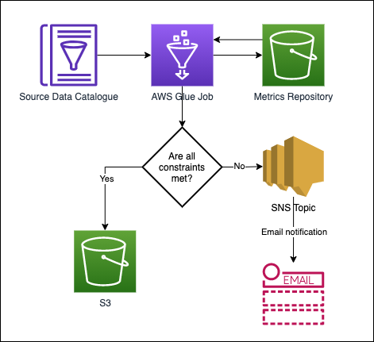

## Context

The Data Platform currently does not have a way to test the data quality of the outputs from Glue jobs

## Decision

Use a Python module; PyDeequ to calculate metrics on data, 
verify suggested data quality constraints as well as define 
custom constraints. 
Datasets being consumed by a Glue job will be analysed to produce
Metrics, which will be stored in a Metrics Repository in the respective 
S3 location of the dataset.
At each Glue job run, the suggested and custom constraints 
will be compared against the latest metrics from the Metrics
Repository in S3. 
If there are no results outside of the set constraints
then the Glue job will proceed as normal and write the output to 
its target S3 location.
If there are any anomalies, then Glue job fails, and an error
will be thrown which is logged in the job's Cloudwatch error logs. 
An SNS topic will watch for Cloudwatch Errors and notify an email 
recipient of the error.

## Considerations

- Will need to have a formal review of acceptable constraints per dataset
consumed by a Glue job.
- On the first run, metrics will be stored without analysing against constraints
to set a benchmark for future constraint analyses.
- Metrics stored in the Metrics Repository in S3 are stored as JSON files and thus
should not be picked up by any Crawlers (providing the Crawlers' configuration
is not changed)

## Consequences

- Users will have confidence that the data being consumed as a result of a Glue job
is of high quality. 
- If there are any anomalies, then users will be notified via email, and the Glue job
is stopped to prevent passing on data that does not meet the specified constraints to 
other Glue jobs or Business Intelligence tools.
